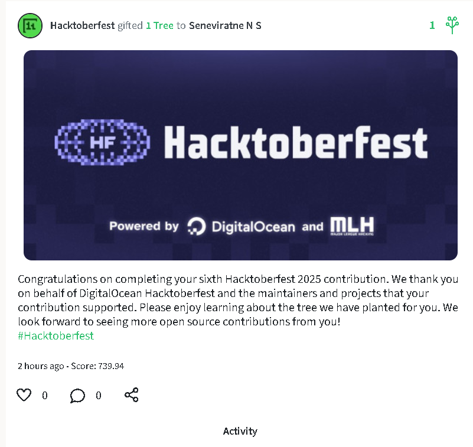
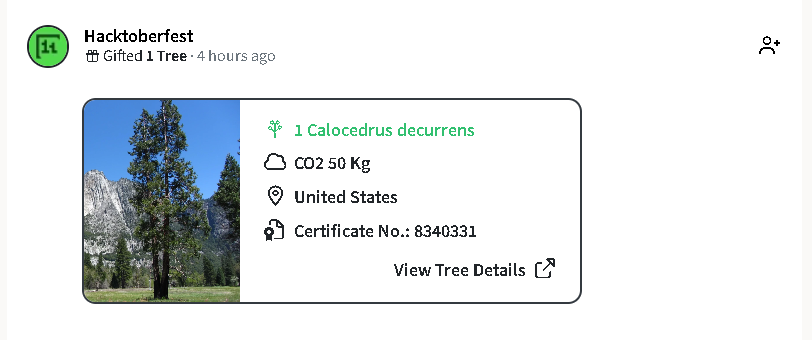
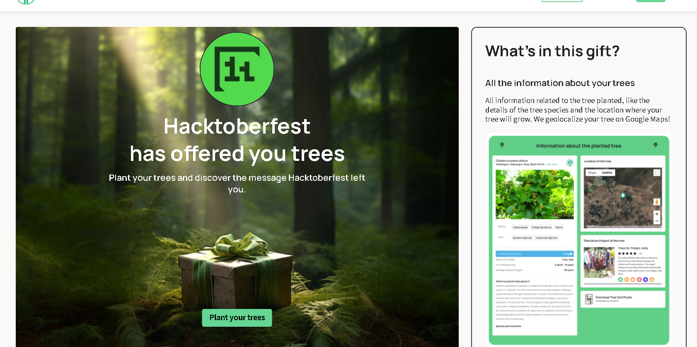

# Hacktoberfest 2025 Contributions 🎃

Welcome to my Hacktoberfest 2025 contributions repository!

This repository showcases all the pull requests I've successfully contributed and had accepted during Hacktoberfest 2025.

## About Hacktoberfest

Hacktoberfest is an annual month-long celebration of open source software. It encourages meaningful contributions to the open source ecosystem and promotes a welcoming community for contributors of all skill levels.

## My Contributions

Check out [CONTRIBUTIONS.md](./CONTRIBUTIONS.md) for a detailed list of all my accepted pull requests during Hacktoberfest 2025.

## Gallery

### Hacktoberfest Journey 🎉

  
  
  
  

### Certificate 🏆
📄 **[Download Certificate (PDF)](./assets/tree-certificate-d5c92328a659c758.pdf)**

## Languages Used

JavaScript, HTML, CSS, Markdown, Documentation

---

*Last Updated: November 5, 2025*
